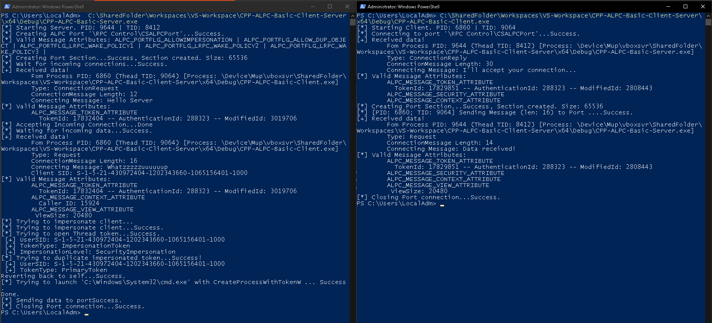

# ALPC-Basic-Client-Server

**Sample ALPC Client and Server written in VC++**

Background and details for this code can be found in this blog post:

[Offensive Windows IPC Internals 3: ALPC](https://csandker.io/2022/05/24/Offensive-Windows-IPC-3-ALPC.html)

An exmaple output is shown below:

